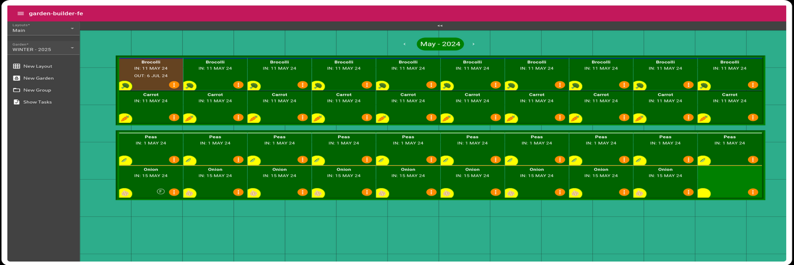

# Garden Builder - Frontend

This project is the frontend for the Garden Builder application. It provides a way to design a garden and 
track planting configurations over time.



It is built using Angular and Angular Material. The backend is a separate project, and can be 
found [here](https://github.com/benleov/garden-builder).

## Development server

This project was generated with [Angular CLI](https://github.com/angular/angular-cli) version 18.

Run `ng serve` for a dev server. Navigate to `http://localhost:4200/`. The app will automatically reload if you 
change any of the source files.

## Code scaffolding

Run `ng generate component component-name` to generate a new component. You can also use `ng generate directive|pipe|service|class|guard|interface|enum|module`.

## Build

Run `ng build` to build the project. The build artifacts will be stored in the `dist/` directory.

## Running unit tests

Run `ng test` to execute the unit tests via [Karma](https://karma-runner.github.io).

## Using mock data

To develop the frontend without a backend present enable HttpClientInMemoryWebApiModule in app.module.ts. This will intercept http requests to the backend,
and return what is described in ``` test-data.service.ts ```.

```
    HttpClientInMemoryWebApiModule.forRoot(TestDataService),
```

## Running end-to-end tests

Run `ng e2e` to execute the end-to-end tests via a platform of your choice. To use this command, you need to first add a package that implements end-to-end testing capabilities.

## Further help

To get more help on the Angular CLI use `ng help` or go check out the [Angular CLI Overview and Command Reference](https://angular.io/cli) page.
